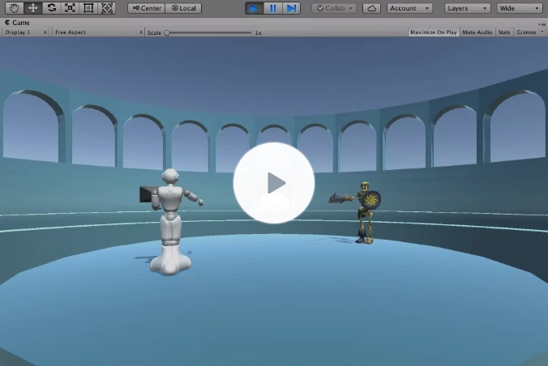
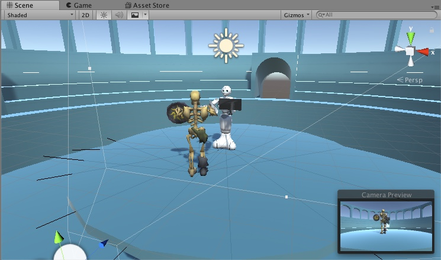

# Glaidaitors
Game jam entry for [Crete Summer School 2018](http://school.gameaibook.org/)

This is the result of a team effort within one day, using [Unity ML-Agents](https://github.com/Unity-Technologies/ml-agents).

It contains a 3D scene with two agents (stiffly) fighting/avoiding each other. When the weapon hits the other's body, the opponent will be pushed backward for a certain distance; when any party falls off the battle-field, that party lose. Any party loses will trigger a random initialization of both agents.

Actions of agents at any time t: 
- rotate a certain degree
- go forward

Two experimental scenarios are tested.

## Avoiding Each Other
Any more step of survival will give +0.005 reward; falling off the arena will give -1 reward; collision will give -1 reward. One shared brain is trained using [PPO](https://blog.openai.com/openai-baselines-ppo/#ppo). The video effect as follows:

## Chasing Each Other
Same as the previous scenarios, yet added two rewards:
- obtain -1 reward getting hit by opponent's weapon;
- obtain +1 reward hitting opponent by weapon.

Train one brain for each agent; the behavior becomes: (click to watch video)

